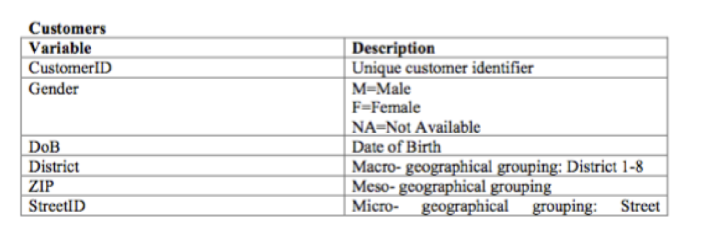
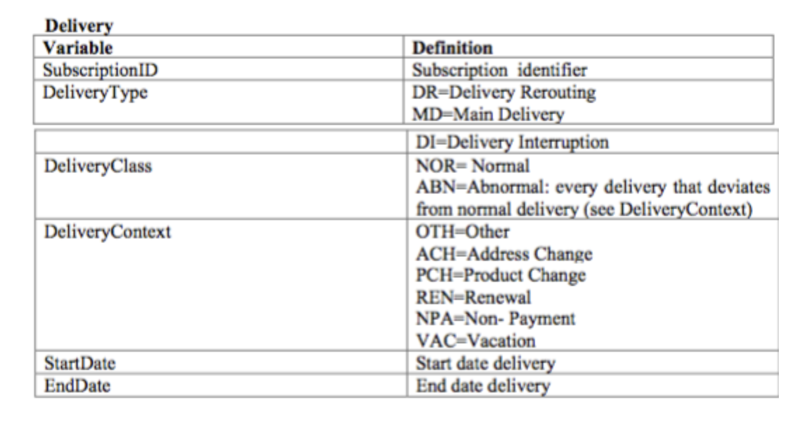
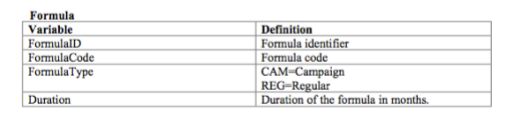
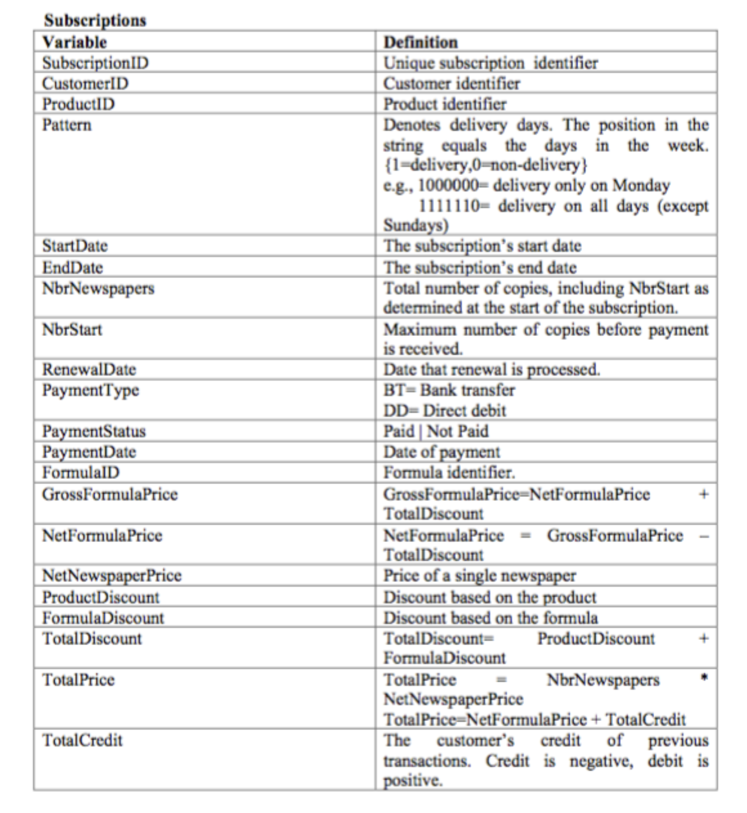
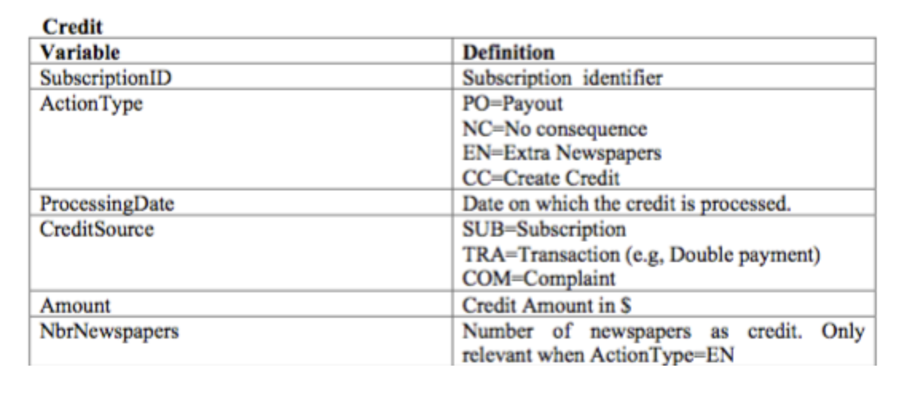

# Classification Problem
## NPC Retention Case Study
A Newspaper Publishing Company (NPC) is facing increasing churn rates since years. 
This evolution has been jumpstarted by the rise of news- websites, and has continued at an accelerating rate due to the 
popularity of tablet computers and (social) news- aggregator applications.
Hence the NPC requires a predictive retention (or churn) model in order to predict which customers will not renew their 
newspaper subscriptions.
Customers are not allowed to cancel their subscriptions; hence a customer is defined as a churner if he or she does not 
renew the subscription once the current subscriptions end.

## Data Description:
Below are the table details:

### Customers

### Delivery

### Formula

### Subscriptions

### Credit

## Solution Notebooks
This problem has been solved using different machine learning algorithms. Below are notebooks for each model. 
|Algorithm|Notebook Name|
|-|-|
|Logistic Regression|[Logistic Regression]((https://colab.research.google.com/github/mkmritunjay/classificationNPC/blob/master/classificationNPC.ipynb))|
|Decision Tree|[Decision Tree]()|
